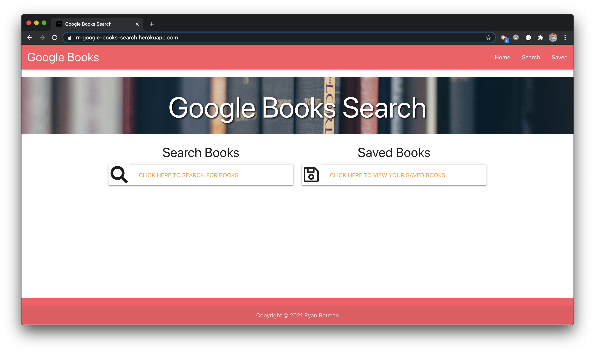
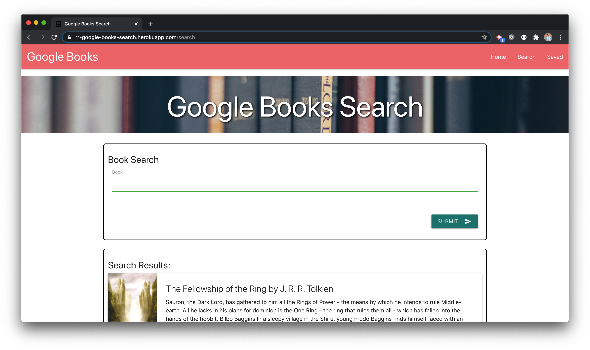
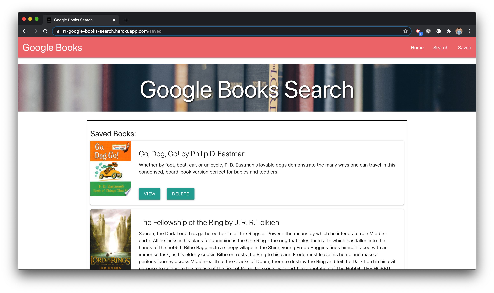

# Google Books React Search

## Description
<!-- This repository holds the homework assignment for Week 21 of the [The Coding Boot Camp](https://techbootcamps.utexas.edu/coding/) through the University of Texas at Austin's Center for Professional Education. -->

This is a full stack application using MongoDB, Express, React, and Node that uses the Google Books API and allows for a user to search for books, view books, and save or delete them from the database.

## Notes
This application took advantage of React Router and has three routes in the single-page application; home, search, and saved. It also uses the Materialize Toast feature to let a user know that a book has been saved as well as deleted. This application was also built with mobile responsiveness and design in mind, so some elements are changed and/or hidden when being views on mobile and tablet devices.

## Instructions
This project can be opened and run in multiple ways.
- You can use this application [here](https://rr-google-books-search.herokuapp.com/).
- You can also clone or fork this application from this [repository](https://github.com/ryanrotman/homework-21-google-books-react-search) and then open it in your text editor of choice. You will also need access to a CLI. This project was created using VSCode and then run in the integrated terminal. Then run ```npm run start``` to launch the application.

## Page Screenshots
Home Page

Search Page

Saved Page


## Contributing
Any and all collaboration is welcome so if you have any suggestions or thoughts for new features, please send me an email at ryan.rotman@gmail.com.